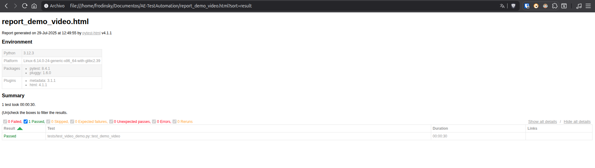
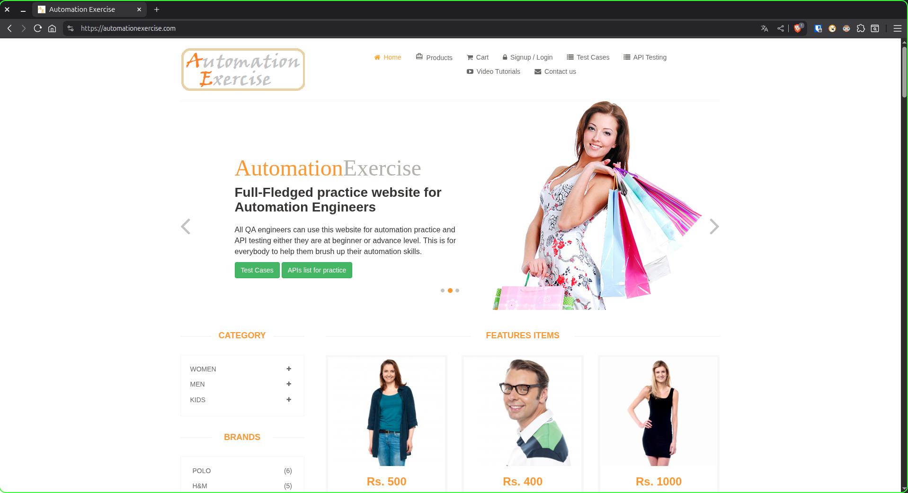
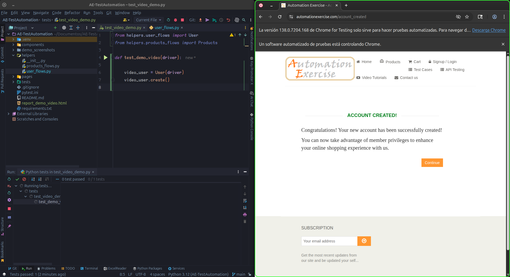
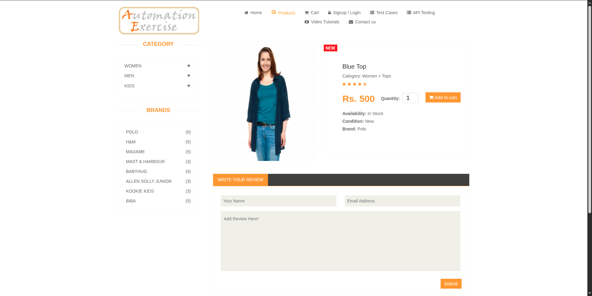

# 🧪 AE Test Automation – Selenium & Python

Automatización de pruebas end-to-end (E2E) robusta y escalable utilizando **Python**, **Selenium WebDriver**, y **Pytest** para el sitio web [Automation Exercise](https://automationexercise.com). Este proyecto es una pieza clave de mi portafolio, destacando mis habilidades en automatización de pruebas moderna, diseño de arquitectura escalable (Page Object Model), y la aplicación de buenas prácticas como el uso de fixtures y modularización.

> 🎯 **Ideal para roles de QA Automation / SDET / Test Engineer**

---

## 📌 Tabla de Contenidos

- [✨ Puntos Clave](#puntos-clave)
- [🚀 Características Destacadas](#caracteristicas-destacadas)
- [🛠️ Tecnologías Utilizadas](#tecnologias-utilizadas)
- [📁 Estructura del Proyecto](#estructura-del-proyecto)
- [▶️ Guía de Ejecución](#guia-de-ejecucion)
- [✅ Casos de Prueba Implementados](#casos-de-prueba-implementados)
- [🧠 Decisiones Técnicas Clave](#decisiones-tecnicas-clave)
- [🗺️ Roadmap y Mejoras Futuras](#roadmap-y-mejoras-futuras)
- [🎥 Demo del Proyecto](#demo-del-proyecto)
- [📸 Capturas de Pantalla](#capturas-de-pantalla)
- [📬 Contacto](#contacto)
  

---

## ✨ Puntos Clave

Este repositorio ofrece una solución de automatización integral para [https://automationexercise.com](https://automationexercise.com), una plataforma pública excelente para la práctica de pruebas. La implementación sigue rigurosamente patrones de diseño como **Page Object Model (POM)** y aprovecha las **fixtures de Pytest** para construir una arquitectura altamente mantenible y reutilizable.

---

## 🚀 Características Destacadas

* **Automatización E2E Completa:** Cobertura de flujos de usuario críticos y reales.
* **Selenium WebDriver & Pytest:** Combinación potente para pruebas web robustas.
* **Arquitectura POM:** Implementación del patrón Page Object Model para una mejor organización y mantenibilidad del código.
* **Modularización Avanzada:** Separación lógica de componentes, helpers y páginas para una mayor claridad y reutilización.
* **Fixtures Reutilizables:** Gestión eficiente de datos y configuraciones con `conftest.py`.
* **Preparado para CI:** Diseño compatible para futura integración con sistemas de Integración Continua.

---

## 🛠️ Tecnologpías Utilizadas

* **Python 3.x:** Lenguaje principal de desarrollo.
* **Selenium WebDriver:** Para la interacción con el navegador.
* **Pytest:** Framework de pruebas para la ejecución y gestión de tests.
* **Page Object Model (POM):** Patrón de diseño para la organización del código.
* **Pytest fixtures (`conftest.py`):** Para la configuración y desconfiguración de tests.

---

## 📁 Estructura del Proyecto

```
AE-TestAutomation/
│
├── components/             \# Elementos de UI reutilizables (ej: encabezados, modales)
├── helpers/                \# Funciones y flujos de usuario comunes (ej: login, navegación)
├── pages/                  \# Page Objects, encapsulando elementos y acciones de cada vista
├── tests/                  \# Archivos con los casos de prueba automatizados
├── conftest.py             \# Fixtures globales y configuraciones para Pytest
├── base\_page.py            \# Clase base con funcionalidades comunes para Page Objects
├── pytest.ini              \# Archivo de configuración para Pytest
└── README.md               \# Documentación principal del proyecto
````

---

## ▶️ Guía de Ejecución

Sigue estos pasos para poner en marcha el proyecto en tu entorno local:

1.  **Clonar el repositorio:**
    ```bash
    git clone [https://github.com/Frodinsky/AE-TestAutomation.git](https://github.com/Frodinsky/AE-TestAutomation.git)
    cd AE-TestAutomation
    ```

2.  **Crear y activar un entorno virtual, e instalar dependencias:**
    ```bash
    python -m venv venv
    source venv/bin/activate   # En Windows: venv\Scripts\activate
    pip install -r requirements.txt
    ```

3.  **Ejecutar todas las pruebas:**
    ```bash
    pytest
    ```
    *(Opcional: Para ejecutar tests específicos, puedes usar `pytest tests/nombre_del_archivo.py`)*

---

## ✅ Casos de Prueba Implementados

Actualmente, el proyecto cubre los siguientes escenarios clave:

* ✅ **Test Case 1:** Verificar la página de inicio.
* ✅ **Test Case 2:** Registro de nuevo usuario.
* ✅ **Test Case 3:** Inicio de sesión del usuario.
* ✅ **Test Case 8:** Navegación por categorías.
* 🛠️ **Test Case 9:** Búsqueda y filtros.
* 🛠️ **Test Case 12:** Añadir productos al carrito desde la página de detalles del producto.

**Próximamente se implementarán los siguientes casos:**

* **Test Case 13:** Verificación de cantidad de productos en el carrito.
* **Test Case 14/15/16:** Realizar un pedido.
* **Test Case 17:** Eliminar productos del carrito.
* **Test Case 20:** Verificar la funcionalidad de suscripción en el pie de página.

---

## 🧠 Decisiones Técnicas Clave

* **Arquitectura Page Object Model (POM):** Cada página o componente significativo de la interfaz de usuario se modela como una clase, encapsulando sus elementos y las interacciones posibles. Esto mejora la legibilidad, mantenibilidad y reusabilidad del código.
* **Uso Extenso de Pytest Fixtures:** `conftest.py` centraliza la configuración y el `teardown` de los tests (ej. inicialización del WebDriver), asegurando un setup limpio y DRY (Don't Repeat Yourself).
* **Separación Clara de Responsabilidades:**
    * `helpers/`: Contiene flujos de usuario de alto nivel que pueden ser reutilizados a través de múltiples tests.
    * `components/`: Almacena clases para elementos de UI que aparecen en varias páginas (ej. un menú de navegación global).
    * `base_page.py`: Proporciona una clase base con métodos comunes para la interacción con elementos web, heredada por todos los Page Objects.
* **Enfoque en la Escalabilidad:** La estructura del proyecto está diseñada para permitir la fácil adición de nuevos tests, páginas o funcionalidades sin impactar negativamente los casos existentes.

---

## 🗺️ Roadmap y Mejoras Futuras

Mi plan para la evolución de este proyecto incluye:

* **Expansión de Cobertura:** Añadir al menos 6 casos de prueba adicionales para cubrir más funcionalidades del sitio.
* ✅**Generación de Reportes:** Integrar la generación de reportes HTML automáticos para una mejor visibilidad de los resultados de las pruebas.
* ✅**Evidencia de Ejecución:** Implementar capturas de pantalla automáticas o grabaciones de video durante la ejecución de los tests.
* **Integración Continua (CI):** Configurar GitHub Actions para ejecutar las pruebas automáticamente en cada push o pull request.

---

## 🎥 Demo del Proyecto

Mira una demostración en video de la ejecución de los tests end-to-end en el proyecto:

[**Ver Demo en Video (YouTube)**](https://youtu.be/gZNL8rM2sJg)

---

## 📸 Capturas de Pantalla

Aquí puedes ver la interfaz de la aplicación y el resultado de las pruebas automatizadas:

* **Reporte de Ejecución de Pruebas:**
    
    *Una visión general de los resultados de las pruebas, mostrando el estado de cada test.*

* **Página de Inicio del Sitio Web:**
    
    *La página principal de "Automation Exercise", punto de partida de las pruebas.*

* **Registro de Usuario Exitoso:**
    
    *Demostración visual del flujo de registro de un nuevo usuario, confirmando el éxito de la operación.*

* **Visualización del Primer Producto:**
    
    *Muestra la página de detalles de un producto, verificando la navegación y la carga de la información del artículo.*

---

## 📬 Contacto

¡Me encantaría conectar! No dudes en contactarme para cualquier pregunta o colaboración.

💼 [LinkedIn](https://www.linkedin.com/in/rodolfo-lara-qa-automation/)
